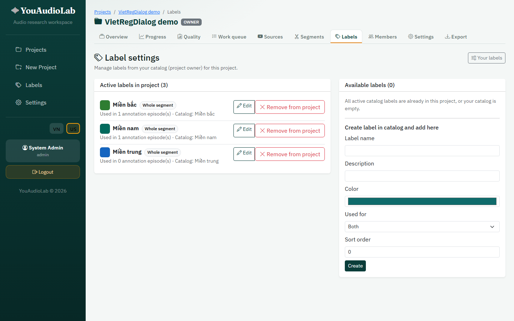
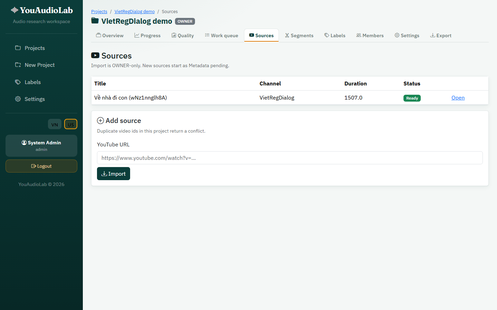
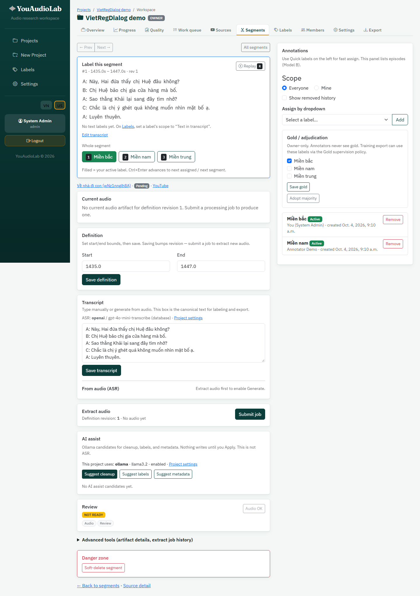
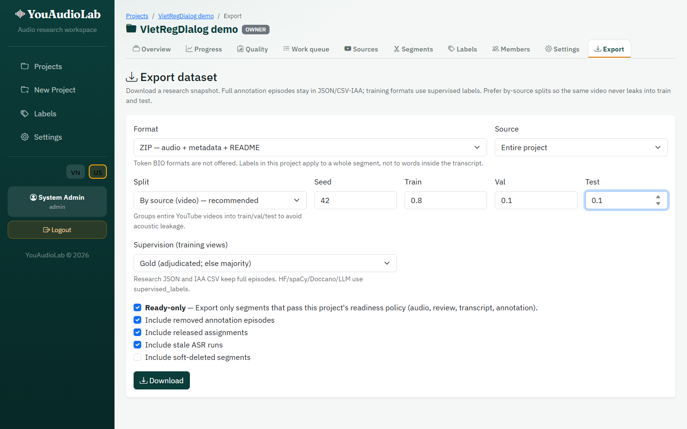

# Example: one VietRegDialog cut through YouAudioLab

This walk-through follows one YouTube cut from the **VietRegDialog** regional
speech inventory and the records written for that cut. It is documentation for
the repository, not a timed user study. The SoftwareX manuscript points here
instead of embedding screenshots in the article.

The cut is **Miền Bắc** dialogue from the film *Về nhà đi con*
(`audio_manifest.csv` id `MB_219`, YouTube `wNz1nnglh8A`, **1435.0–1447.0 s**,
12 s). Project labels are the three region classes from
`VietRegDialog.xlsx`: `Miền bắc`, `Miền nam`, and `Miền trung` (whole-segment
scope). Interface figures under
[`software/figures/appendix/`](software/figures/appendix/) were captured from
the seeded **VietRegDialog demo** project
(`docs/software/figures/seed_appendix_demo.py`).

## 1. Protocol

1. Create a project named **VietRegDialog demo** and set the language to `vi`.
2. Leave audio defaults at **WAV / PCM / 16 kHz / mono**.
3. Turn readiness gates on so a segment needs a transcript and at least one
   label before export.
4. Keep **blind labelling** on.
5. Enter a licence string and a short consent note on project settings (both
   are copied into research JSON and the quality report).
6. Add annotators as project members (**owner** vs **annotator**).
7. Define three project labels with scope **whole segment**: `Miền bắc`,
   `Miền nam`, `Miền trung`.

   

8. Only users on the system allowlist can change the global recognition
   endpoint (`ASR_ADMIN_USER_IDS`).

## 2. A cut and an accepted transcript

1. Import the YouTube URL for the episode. After the source is ready, it
   appears in the project source list as *Về nhà đi con*.

   

2. Create a segment from **1435.0 s to 1447.0 s** (manifest `MB_219`) and queue
   **extract** when a worker is available.
3. Set the accepted transcript to the dialogue text from the **Miền Bắc** sheet
   of `VietRegDialog.xlsx` for those bounds, for example:

   ```text
   A: Này, Hai đứa thấy chị Huệ đâu không?
   B: Chị Huệ bảo chị gia cửa hàng mà bố.
   A: Sao thằng Khải lại sang đây tìm nhở?
   C: Chắc là chị ý ghét quá không muốn nhìn mặt bố ạ.
   A: Luyên thuyên.
   ```

4. Optionally queue **recognition** and compare the candidate to that text, then
   keep the accepted transcript you verified.

   

5. If you later change the end time, `definition_revision` increases. A job
   still running against the old revision cannot become the current artifact.

## 3. Labels on the same cut

1. Assign the segment so two people can label it (owner and annotator).
2. The owner selects **`Miền bắc`**. The annotator selects **`Miền nam`**.
   With blind labelling on, neither sees the other’s row in the workspace.
3. Pairwise Jaccard for `{Miền bắc}` vs `{Miền nam}` is
   `|A ∩ B| / |A ∪ B| = 0 / 2 = 0` before adjudication.
4. The owner saves **gold** as `Miền bắc`. Annotator rows remain in the
   research export; training views that use the `gold` supervision policy keep
   `Miền bắc` only.
5. Optional text span: if a token in the accepted transcript needs a
   phrase-level tag, drag that span and assign a text-scoped label. That
   `TranscriptSpan` does not change whole-segment gold or the Jaccard figure
   above.

## 4. Export

1. Export a zip with supervision policy **`gold`**, split strategy
   **`by_source`**, seed **`42`**, and ratios **`0.8 / 0.1 / 0.1`**.

   

2. The archive writes verified audio under `audio/` (when extract has produced
   a current artifact) and points `metadata.csv` at that path beside the
   transcript, start/end times, video title, and active text spans.
3. `spans.csv` repeats the YouTube link and clip interval on each span row.
4. Research JSON describes the file by checksum and sample rate (no embedded
   waveform) and keeps annotator rows, gold names, `supervised_labels`, and
   `text_spans`. Schema version is **`youaudiolab.research_dataset` 1.2**.
5. For this segment the gold training view contains `Miền bắc` and not
   `Miền nam`.
6. Additional videos from other VietRegDialog sheets would each receive their
   own fold under `by_source`: the split is on video identifiers, then copied
   onto segments. Same inputs reproduce the same folds; the content hash is
   unchanged if only the export clock changes.

Word times from a recognition run are not written into these files. The
published item is the checksummed waveform with its bounds, transcript, and
optional character spans—not a text row alone.

## Reproduce the demo screenshots

```powershell
cd YouAudioLab_Django
docker compose up -d db redis
python manage.py migrate
python manage.py seed_admin --write-env
python manage.py runserver 8001
# other terminal: celery -A config.celery worker --loglevel=info --pool=solo
python docs/software/figures/seed_appendix_demo.py --login admin --prefer-id MB_219
python docs/software/figures/capture_appendix_a.py
```

IDs for the last seed are written to
`docs/software/figures/appendix_demo_ids.json`.

## Related reading

- [README — Building a corpus](../README.md#building-a-corpus)
- [README — Export formats](../README.md#export-formats)
- SoftwareX manuscript drafts under [`software/`](software/)
